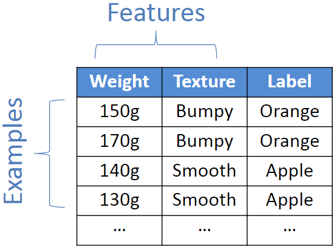
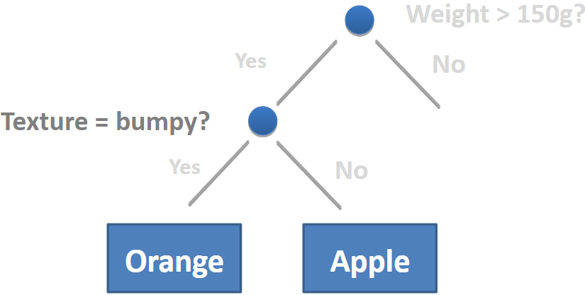

# COMP306 API Engineering & Cloud Computing Assignment 3

## Machine Learning Basics
The purpose of this assignment is to demonstrate the basics of machine learning by:
- Importing Data into a Python Application using `sklearn` package and datasets from online repositories (e.g. https://archive.ics.uci.edu/ml/datasets.html?format=&task=&att=&area=&numAtt=&numIns=&type=&sort=attUp&view=table)
- Using Decision Trees for the purpose of Classification
- Train a Classifier
- Demo the Classifier in a Simple Web Application

>*NOTE:* **Decision Trees** are a type of **Supervised Machine Learning** where we explain what the input is and what the corresponding output is in the training data.

### Supervised Learning
Here we are following the typical **Supervised Learning Recipe**:

#### 1. Collect Training Data
- The more data we can obtain, the better the classifier we can make.
- Split the data we gathered into two sets of data
    - Training data
    - Testing data
        - small subset of data to be reserved for testing data 
        - this is to prevent the issue of **over-fitting** from occurring
- e.g. of data 
- 
    
#### 2. Training the Classifier
- _NOTE_: We need to use integer values in place of text labels for the **features** of our training data 
- There are many different classifiers, we will be using **decision tree** in our application
- we can define a **classifier as a box of rules**
- to train it, we need a **learning algorithm - procedure that creates those rules**
    - by finding the pattern in our training data
- e.g. 
- in scikit, the training algorithm is included in the `classifier object` and is called `fit`
    - this finds the pattern in our data
        ```
        clf = tree.DecisionTreeClassifier()
        clf.fit(train_data, train_target)
        ```
    
#### 3. Make Predictions using the trained classifier
- e.g. 

## References
- COMP306 API Engineering & Cloud Computing Lecture Notes
- Data from [UCI Machine Learning Repository](https://archive.ics.uci.edu/ml/datasets.html?format=&task=&att=&area=&numAtt=&numIns=&type=&sort=attUp&view=table)